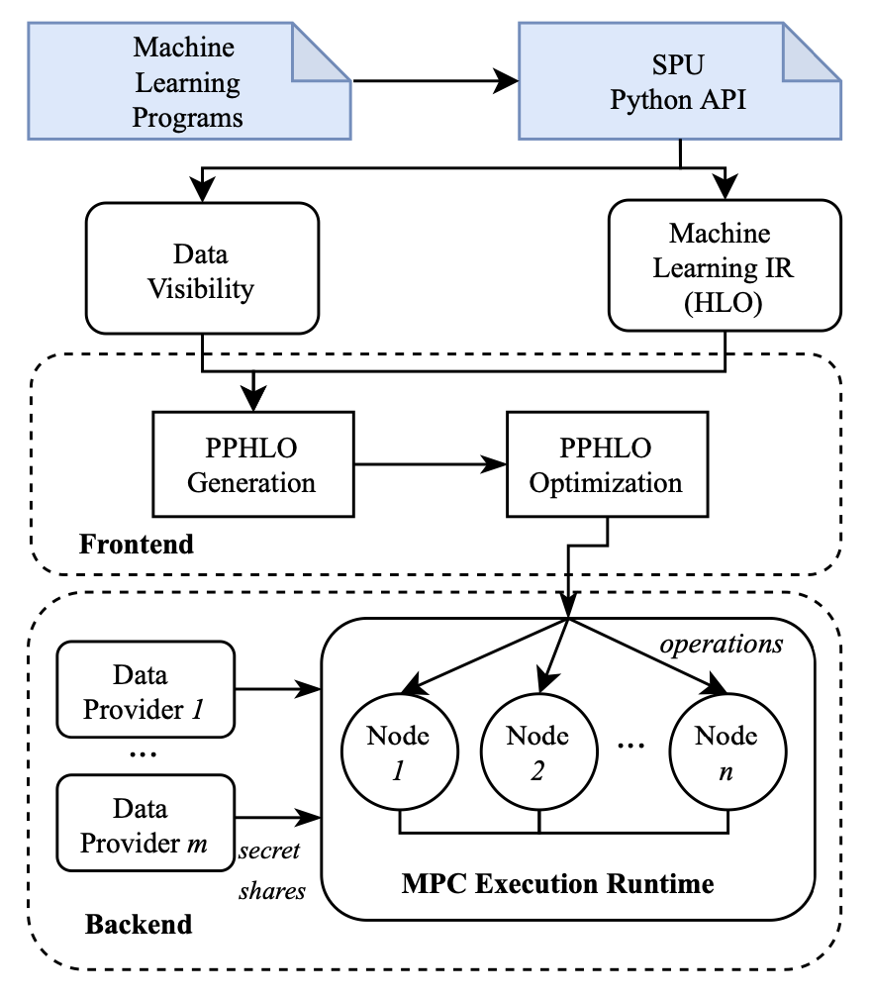

# SecretFlow-SPU: A Performant and User-Friendly Framework for Privacy-Preserving Machine Learning

**URL:** https://www.usenix.org/conference/atc23/presentation/ma

## Basic Introduction to Secretflow SPU
For Machine Learning compiler and MPC, SPU is a powerful tool which can be adopted to ML models. Rather than integrated with `Pytorch` and `Tensorflow`, this tool chooses `JAX` as its framework mainly because Jax has the support on many different types of hardwares like Google TPU and Hisilicon NPU.

## Frontend and Backend introduction


## Usage of SPU (on Yao's millionaire problem)
```python
import jax.numpy as jnp
import numpy as np
import spu.utils.distributed as ppd

@ppd.device("P1")
def data_from_alice():
    return np.random.randint(100, size=(4,))

@ppd.device("P2")
def data_from_bob():
    return np.random.randint(100, size=(4,))

@ppd.device("SPU")
def compare(x, y):
    return jnp.maximum(x, y)

x = data_from_alice()
y = data_from_bob()

z = compare(x, y)
print(f"z = {ppd.get(z)}")
```

